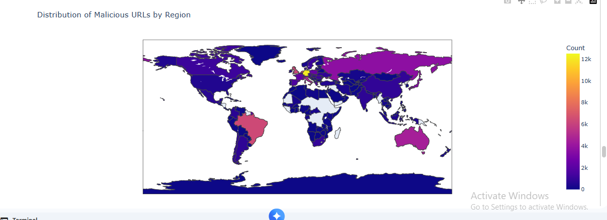
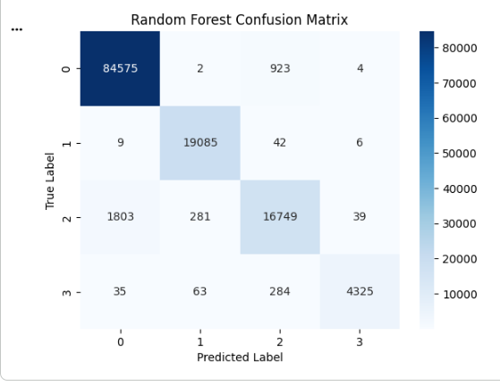

# 🔒 Malicious URL Detection using Machine Learning

## 📌 Overview

This project presents a Machine Learning approach for detecting malicious URLs using feature engineering and classification algorithms. The system analyzes URL characteristics and classifies URLs as either **Benign** or **Malicious**, helping improve cybersecurity and online safety.

---

## 🎯 Objective

The main objective of this project is to build an accurate machine learning model capable of detecting malicious URLs based on extracted URL features.

---

## 📊 Dataset

The dataset contains URLs labeled as:

- Benign
- Malicious

After preprocessing, useful features were extracted from each URL to improve the performance of the machine learning models.

---

## ⚙️ Workflow

1. Load the dataset.
2. Data preprocessing and cleaning.
3. Feature engineering.
4. Exploratory Data Analysis (EDA).
5. Train Machine Learning models.
6. Evaluate model performance.
7. Compare model results.

---

## 🤖 Models Used

- Random Forest Classifier
- Gradient Boosting Classifier

---

## 📈 Evaluation Metrics

- Accuracy
- Confusion Matrix
- Classification Report

---

## 🖼️ Results

### Dataset Distribution


---

### Distribution of Malicious URLs by Region



---

### Random Forest Confusion Matrix



---

### Gradient Boosting Confusion Matrix


The trained machine learning models successfully classified malicious and legitimate URLs, demonstrating the effectiveness of machine learning techniques for cybersecurity applications.

---

## 🛠️ Technologies Used

- Python
- Pandas
- NumPy
- Matplotlib
- Plotly
- Scikit-learn

---

## ▶️ How to Run

```bash
git clone https://github.com/Meriam-aziz/Malicious-URL-Detection-using-Machine-Learning.git

cd Malicious-URL-Detection-using-Machine-Learning

pip install -r requirements.txt

jupyter notebook "Malicious URLs.ipynb"
```

---

## 📁 Project Structure

```text
Malicious-URL-Detection-using-Machine-Learning/
│
├── images/
│   ├── dataset_distribution.png.png
│   ├── malicious_urls_by_region.png.png
│   ├── random_forest.png.png
│   └── gradient_boosting.png.png
│
├── Malicious URLs.ipynb
├── README.md
└── requirements.txt
```

---

## 🚀 Features

- URL preprocessing and feature engineering.
- Exploratory Data Analysis (EDA).
- Machine Learning classification using multiple models.
- Performance evaluation using confusion matrices.
- Comparison between Random Forest and Gradient Boosting classifiers.

---

## 👩‍💻 Author

**Meriam Aziz**

---

## ⭐ Future Improvements

- Deploy the model as a web application using Streamlit or Flask.
- Add real-time URL prediction.
- Improve feature extraction techniques.
- Explore Deep Learning approaches for malicious URL detection.

