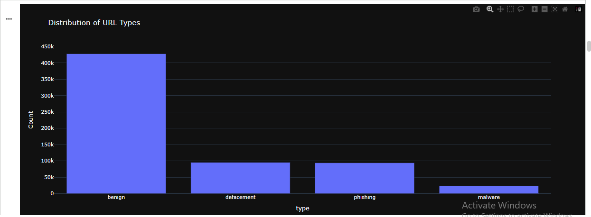
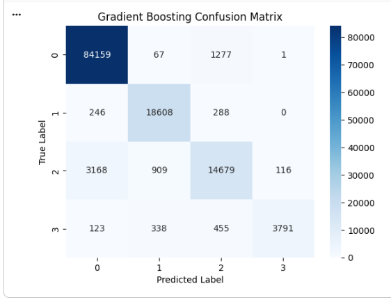

# 🔒 Malicious URL Detection using Machine Learning

## 📌 Overview

This project presents a Machine Learning approach for detecting and classifying malicious URLs. By applying feature engineering and classification algorithms, the system can distinguish between legitimate and malicious websites, helping improve cybersecurity and online safety.

---

## 🎯 Objective

The objective of this project is to build a reliable machine learning model capable of identifying malicious URLs based on extracted URL features and classification techniques.

---

## 📊 Dataset

The dataset consists of URLs labeled as either:

* **Benign**
* **Malicious**

The data is preprocessed and transformed into meaningful numerical features before training the machine learning models.

---

## ⚙️ Workflow

1. Load the dataset.
2. Perform data preprocessing and cleaning.
3. Extract useful features from URLs.
4. Explore the dataset using visualizations.
5. Train Machine Learning models.
6. Evaluate model performance.
7. Compare classification results.

---

## 🤖 Models Used

* Random Forest Classifier
* Gradient Boosting Classifier

---

## 📈 Evaluation Metrics

* Accuracy
* Confusion Matrix
* Classification Report

---

## 🖼️ Results

### Dataset Distribution



---

### Distribution of Malicious URLs by Region


---

### Random Forest Confusion Matrix


---

### Gradient Boosting Confusion Matrix



The machine learning models successfully classified malicious and legitimate URLs, demonstrating strong performance in cybersecurity threat detection.

---

## 🛠️ Technologies Used

* Python
* Pandas
* NumPy
* Matplotlib
* Plotly
* Scikit-learn

---

## ▶️ How to Run

```bash
git clone https://github.com/Meriam-aziz/Malicious-URL-Detection-using-Machine-Learning.git

cd Malicious-URL-Detection-using-Machine-Learning

pip install -r requirements.txt

jupyter notebook "Malicious URLs.ipynb"
```

---

## 📁 Project Structure

```text
Malicious-URL-Detection-using-Machine-Learning/
│
├── images/
│   ├── Dataset Distribution.png
│   ├── Distribution of Malicious URLs by Region.png
│   ├── Random Forest.png
│   └── Gradient Boosting.png
│
├── Malicious URLs.ipynb
├── README.md
└── requirements.txt
```

---

## 🚀 Features

* URL preprocessing and feature engineering.
* Exploratory Data Analysis (EDA).
* Machine Learning classification.
* Performance evaluation using confusion matrices.
* Comparison between Random Forest and Gradient Boosting models.

---

## 👩‍💻 Author

**Meriam Aziz**

---

## ⭐ Future Improvements

* Deploy the model as a web application using Streamlit or Flask.
* Support real-time URL prediction.
* Improve feature extraction techniques.
* Explore Deep Learning approaches for malicious URL detection.

